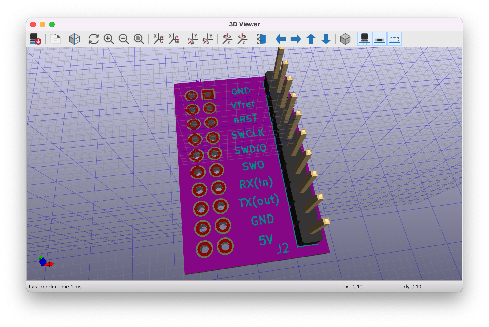

# ARM Cortex SWD Adapter with UART

A simple adapter to connect ARMT Cotext development boards SEGGER's J-Link and also provide access to the virtual COM port.

The adapter can be directly plugged into the [20-pin JTAG interface](https://www.segger.com/products/debug-probes/j-link/technology/interface-description/).
On the other side, the 10-pin header JP2 can be connected to the SWD interface of the dev kit. J-Link requires a connection to the target VDD as well. 
Finally, the J-Link provides a 5V output, which can be used to power the dev board as well (please check documentation about how to configure this)

<!-- It is can be directly [ordered at OSHpark](...)

-->
